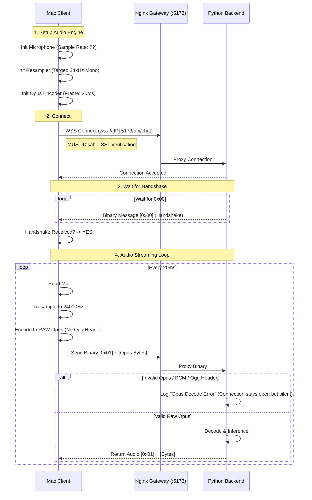

# Client Debug Request: Audio Integration & SSL Fixes

The PersonaPlex backend is currently crashing when receiving binary data from the Mac client. This documented is intended for the AI Agent working on the Mac/Reachy client to fix the communication layer.

## 🔴 1. Critical Crash: Audio Format Mismatch
The server logs throw a `ValueError: sending on a closed channel` in `sphn.OpusStreamReader`. This happens when the payload following the `0x01` byte is NOT a valid Opus frame.

### **Required Audio Specs:**
- **Codec:** Raw Opus (NOT Ogg/Opus, NOT WAV).
- **Sample Rate:** Exactly **24,000 Hz**.
- **Channels:** **Mono (1)**.
- **Frame Size:** Recommended **20ms** (480 samples @ 24kHz).
- **Message Structure:** Binary Packet = `[0x01]` + `[Raw Opus Frame Bytes]`.

### **Potential Fixes in Client Code:**
1. **Remove Ogg Encapsulation:** If using a library like `swift-opus` or `AVFoundation`, ensure you are stripping any Ogg headers and sending only the raw compressed packet.
2. **Verify Resampling:** If the Mac mic is 44.1kHz or 48kHz, ensure the resampler is outputting exactly 24kHz.
3. **Internal Buffer:** Ensure you are not sending empty audio buffers or partial packets.

---

## 🔒 2. SSL/WSS Handshake
The PersonaPlex Unified Gateway now uses **Nginx with a self-signed certificate** on port **5173**.

### **Required Client Configuration:**
- **Protocol:** `wss://` (WebSocket Secure).
- **Port:** `5173`.
- **SSL Verification:** Must be **DISABLED** (Allow untrusted certificates).

---

## 🤝 3. Connection Flowchart
The client must follow this exact sequence to successfully stream audio.

## 🛠️ Verification Test
To confirm the client is working:
1. It should successfully bypass the SSL warning.
2. It should log "Received 0x00 handshake from server".
3. The server should NOT throw "ValueError: sending on a closed channel" when audio starts.
